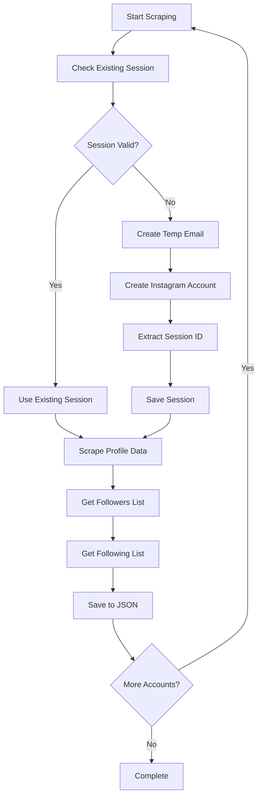

# 🔍 Instagram Profile Scraper

<div align="center">

**A powerful Python tool for comprehensive Instagram profile data extraction**


</div>

## 📋 Table of Contents

- [Features](#-features)
- [Demo](#-demo)
- [Quick Start](#-quick-start)
- [Installation](#-installation)
- [Configuration](#-configuration)
- [Usage](#-usage)
- [How It Works](#-how-it-works)
- [Output Format](#-output-format)
- [Advanced Configuration](#-advanced-configuration)
- [Troubleshooting](#-troubleshooting)
- [Legal & Ethical Guidelines](#-legal--ethical-guidelines)
- [Contributing](#-contributing)

## ✨ Features

### Core Data Extraction
- 👤 **Complete Profile Information**: Full name, bio, website links
- 📊 **Engagement Metrics**: Posts, followers, and following counts
- 👥 **Comprehensive Lists**: Complete followers and following with detailed user info
- 🔄 **Paginated Collection**: Handles large follower/following lists automatically

### Automation & Reliability
- 🤖 **Automated Account Creation**: Creates Instagram accounts using temporary emails
- 🔐 **Session Management**: Persistent session storage with automatic renewal
- 🔄 **Intelligent Retry Logic**: Automatic account recreation on failures
- ⏱️ **Rate Limit Protection**: Smart delays and request throttling
- 📝 **Comprehensive Logging**: Detailed error tracking and debugging

## 🎬 Demo

### Automated Account Creation Process
<!-- Replace 'your-gif-filename.gif' with your actual GIF filename -->


*The tool automatically creates Instagram accounts using temporary emails and browser automation*

## 🚀 Quick Start

```bash
# Clone the repository
git clone https://github.com/yourusername/instagram-scraper.git
cd instagram-scraper

# Install dependencies
pip install -r requirements.txt
playwright install chromium

# Setup environment
echo "RAPIDAPI_KEY=your_api_key_here" > .env

# Run the scraper
python insta_scraper.py
```

## 📦 Installation

### Prerequisites
- Python 3.7 or higher
- RapidAPI account with "Privatix Temp Mail" subscription

### Step-by-step Installation

1. **Clone the Repository**
   ```bash
   git clone <your-repo-url>
   cd instagram-scraper
   ```

2. **Create Virtual Environment** (Recommended)
   ```bash
   python -m venv venv
   source venv/bin/activate  # On Windows: venv\Scripts\activate
   ```

3. **Install Dependencies**
   ```bash
   pip install requests playwright python-dotenv
   ```

4. **Install Browser**
   ```bash
   playwright install chromium
   ```

5. **Setup Environment Variables**
   ```bash
   touch .env
   ```

## ⚙️ Configuration

### Environment Setup

Create a `.env` file in the project root:

```env
RAPIDAPI_KEY=your_rapidapi_key_here
```

### Getting Your RapidAPI Key

1. 🌐 Visit [RapidAPI](https://rapidapi.com/) and create an account
2. 🔍 Search for "Privatix Temp Mail" API
3. 💳 Subscribe to the service (free tier available)
4. 🔑 Copy your API key from the dashboard
5. 📝 Add it to your `.env` file

## 💻 Usage

### Basic Usage

1. **Configure Target Accounts**
   
   Edit the target list in `insta_scraper.py`:
   ```python
   example_accounts_to_scrape = [
       "natgeo",
       "nasa", 
       "username_here",
   ]
   ```

2. **Run the Scraper**
   ```bash
   python insta_scraper.py
   ```

3. **Monitor Progress**
   
   The script will automatically:
   - Create temporary email accounts
   - Generate Instagram accounts
   - Extract session IDs
   - Scrape target profiles
   - Save data to JSON files

### Advanced Usage

**Custom Retry Configuration:**
```python
numb_of_retires = 5  # Increase retry attempts
```

**Adjust Rate Limiting:**
```python
time.sleep(random.randint(2, 8))  # Increase delays
```

## 🔧 How It Works

### Architecture Overview



### Process Flow

1. **🔍 Session Check**: Verifies existing session validity
2. **📧 Email Generation**: Creates temporary email via RapidAPI
3. **🤖 Account Creation**: Automates Instagram signup using Playwright
4. **🔐 Session Extraction**: Captures and stores authentication tokens
5. **📊 Data Collection**: Scrapes comprehensive profile information
6. **💾 Data Storage**: Exports structured JSON files

## 📄 Output Format

Each scraped account generates a detailed JSON file:

```json
{
    "user_id": "123456789",
    "user_full_name": "National Geographic",
    "user_biography": "Experience the world through the eyes of National Geographic photographers.",
    "user_bio_links": ["https://www.nationalgeographic.com"],
    "user_posts_count": 15420,
    "user_followers_count": 283000000,
    "user_following_count": 147,
    "followers_accounts": [
        {
            "id": "follower_user_id",
            "username": "follower_username",
            "full_name": "Follower Display Name",
            "profile_pic_url": "https://instagram.com/...",
            "is_private": false,
            "is_verified": true,
            "follower_count": 50000,
            "following_count": 200
        }
    ],
    "following_accounts": [
        {
            "id": "following_user_id",
            "username": "following_username", 
            "full_name": "Following Display Name",
            "profile_pic_url": "https://instagram.com/...",
            "is_private": false,
            "is_verified": false,
            "follower_count": 25000,
            "following_count": 500
        }
    ]
}
```

## 🔧 Advanced Configuration

### Project Structure
```
instagram-scraper/
├── 📄 insta_scraper.py          # Main scraper logic
├── 📄 create_email.py           # Temporary email management
├── 📄 insta_account_creation.py # Automated account creation
├── 📁 data/                     # Scraped data storage
├── 📁 demo/                     # Demo GIFs and screenshots
├── 🔧 account_session_id.json   # Session storage
├── 🔧 email_hash.json          # Email credentials
├── 🔧 .env                     # Environment variables
└── 📖 README.md               # Documentation
```

### Customization Options

**Rate Limiting Settings:**
```python
MIN_DELAY = 2    # Minimum delay between requests
MAX_DELAY = 8    # Maximum delay between requests
REQUEST_TIMEOUT = 30  # Request timeout in seconds
```

**Retry Configuration:**
```python
MAX_RETRIES = 3           # Maximum retry attempts
RETRY_DELAY = 5           # Delay between retries
SESSION_RETRY_LIMIT = 5   # Session creation retries
```

**Browser Settings:**
```python
HEADLESS_MODE = True      # Run browser in headless mode
BROWSER_TIMEOUT = 30000   # Browser operation timeout
```

## 🛠️ Troubleshooting

### Common Issues & Solutions

| Issue | Possible Cause | Solution |
|-------|----------------|----------|
| **"Failed to get user info"** | Invalid RapidAPI key | Verify API key and subscription |
| **Account creation failures** | Email service issues | Check RapidAPI service status |
| **Session expiration** | Instagram security measures | Increase delays between requests |
| **Browser automation errors** | Playwright issues | Reinstall browser: `playwright install` |
| **Rate limiting** | Too many requests | Increase `time.sleep()` values |

### Debug Mode

Enable detailed logging:
```python
import logging
logging.basicConfig(level=logging.DEBUG)
```

Run with visible browser for debugging:
```python
browser = playwright.chromium.launch(headless=False)
```

### Performance Tips

- **Batch Processing**: Process accounts in smaller batches
- **Parallel Processing**: Use threading for multiple accounts (with caution)
- **Caching**: Implement result caching to avoid re-scraping
- **Monitoring**: Use logging to track performance metrics

## ⚖️ Legal & Ethical Guidelines

### ✅ Recommended Practices
- Only scrape **public profiles**
- Respect **rate limits** and implement delays
- Use data for **research/analysis purposes**
- Implement **proper error handling**
- Follow **robots.txt** guidelines

### ⚠️ Important Warnings
- **Instagram ToS**: Automated account creation may violate terms
- **Privacy Concerns**: Respect user privacy and data protection laws
- **Rate Limiting**: Instagram has sophisticated detection systems
- **Legal Compliance**: Ensure compliance with local data protection laws

### 🚫 Prohibited Uses
- Commercial data reselling
- Harassment or stalking
- Spam or unsolicited messages
- Violation of user privacy
- Circumventing platform security


We welcome contributions! Please follow these steps:


### Contribution Guidelines
- Follow PEP 8 style guidelines
- Add tests for new features
- Update documentation
- Ensure backward compatibility
- Add meaningful commit messages


## ⚠️ Disclaimer

**This tool is for educational and research purposes only.** Users are responsible for:
- Complying with Instagram's Terms of Service
- Respecting applicable laws and regulations
- Following ethical data collection practices
- Obtaining necessary permissions for data use

The developers assume no responsibility for misuse or any consequences resulting from the use of this tool.

---

<div align="center">

**Made with ❤️ for the developer community**

⭐ Star this repo if you find it helpful!

</div>